# McCain Unified Onboarding Portal — Architecture

> Diagrams render natively on GitHub. For standalone export, paste any block into [mermaid.live](https://mermaid.live).

---

## 1. System Overview

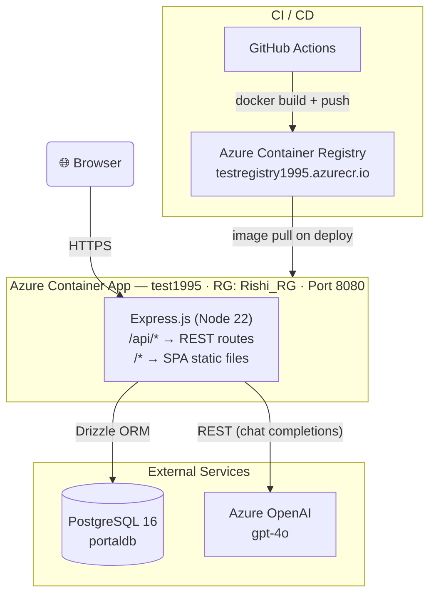

---

## 2. Monorepo Package Structure

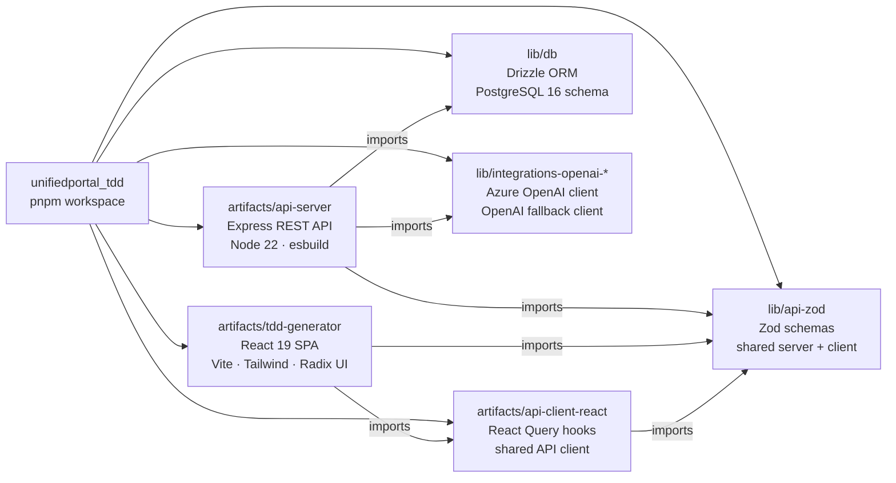

---

## 3. Request Workflow (State Machine)

```mermaid
stateDiagram-v2
    direction LR

    [*] --> submitted : Requestor submits

    submitted --> ea_approved : AI → simple\n(fast-track)
    submitted --> ea_triage   : AI → complex

    ea_triage --> ea_approved          : EA approves
    ea_triage --> submitted            : EA requests changes

    ea_approved --> tdd_in_progress    : Cloud Architect starts TDD

    tdd_in_progress --> tdd_completed  : CA completes TDD

    tdd_completed --> devsecops_approved : CA approves DevSecOps / IaC
    tdd_completed --> tdd_in_progress    : CA rejects — rework

    devsecops_approved --> finops_active : EA activates FinOps

    finops_active --> [*]
```

### AI Classification Logic

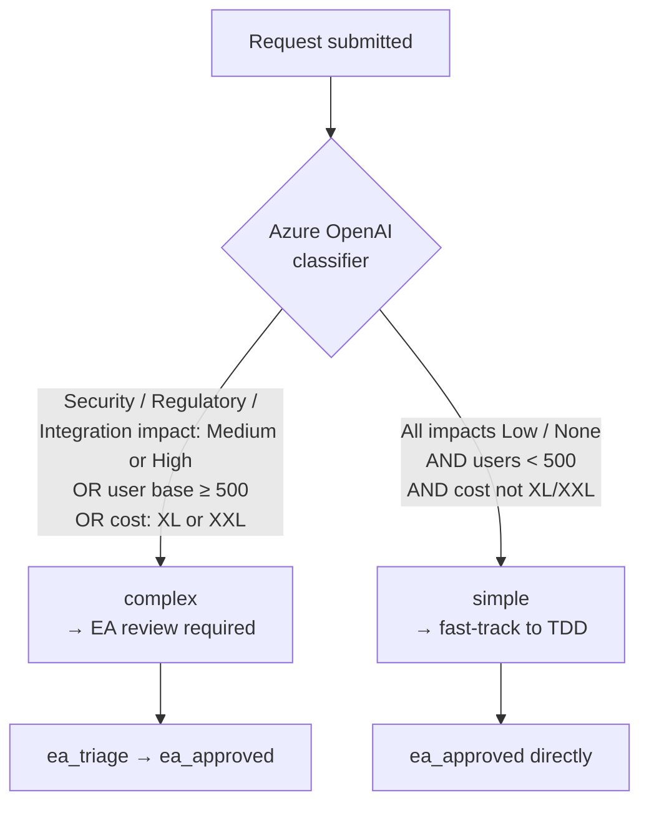

---

## 4. Authentication & Roles

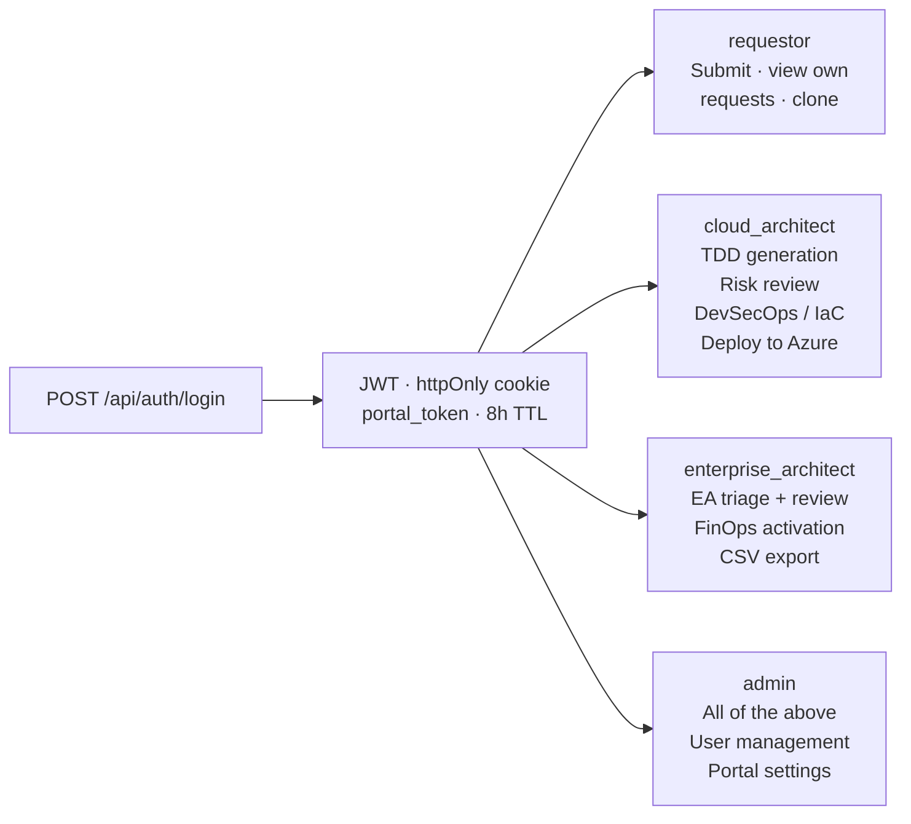

---

## 5. API Structure

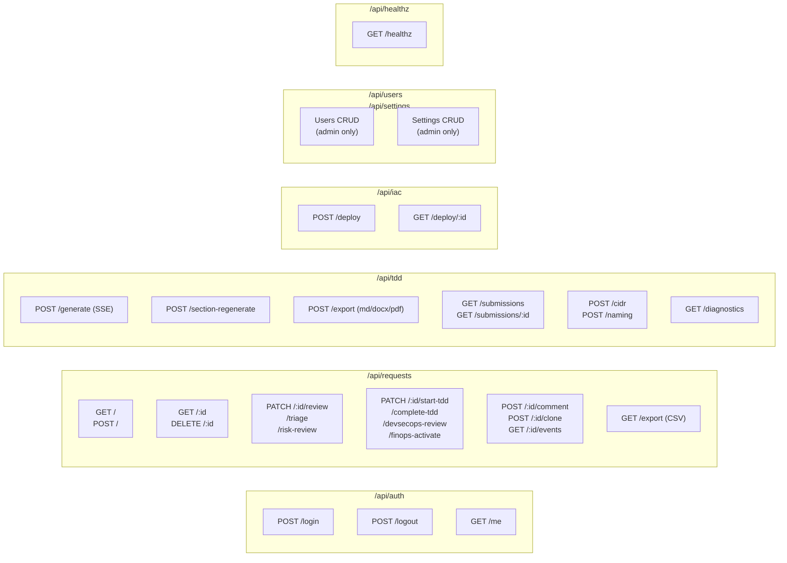

---

## 6. Database Schema

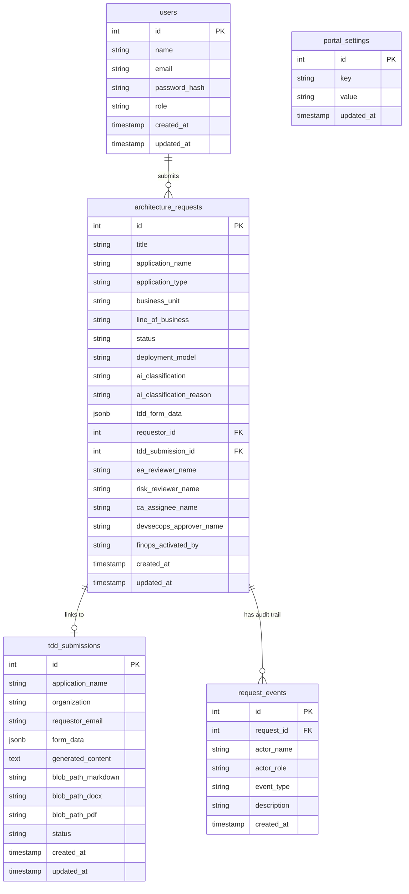

---

## 7. Frontend Page Map

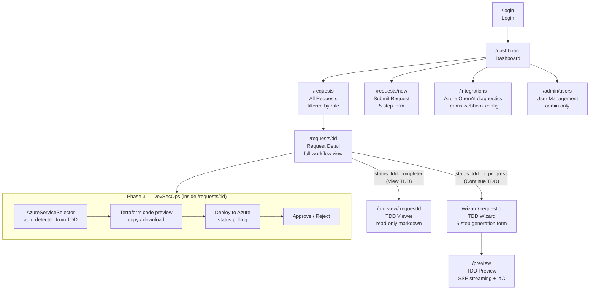

---

## 8. AI Integration

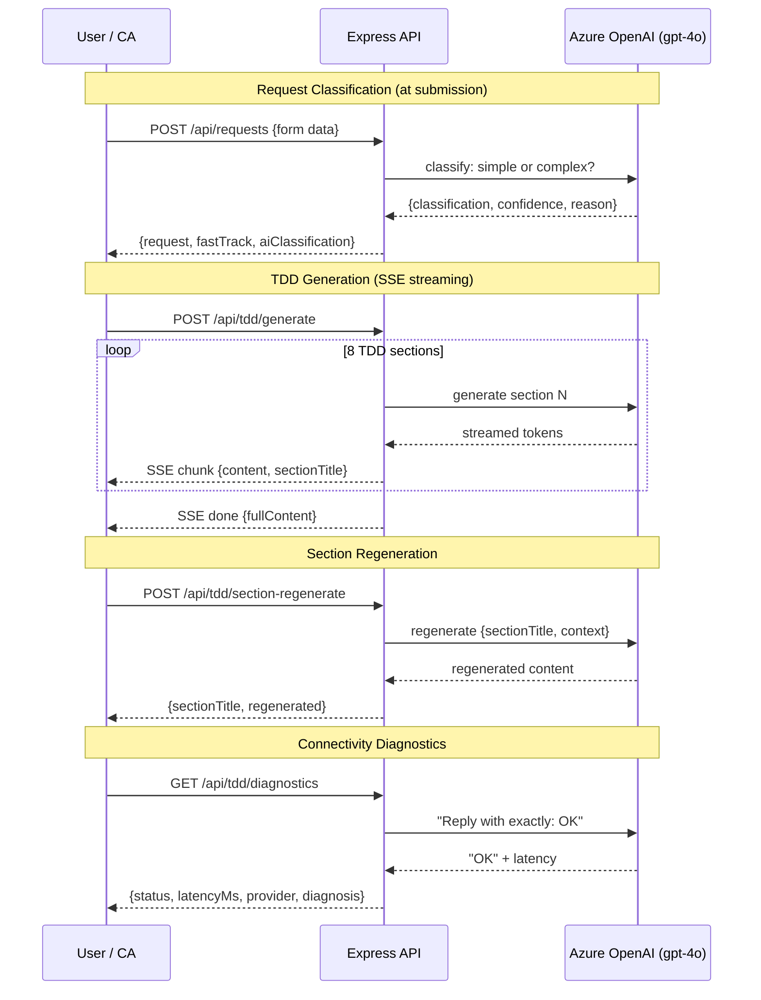

---

## 9. IaC Deployment Flow

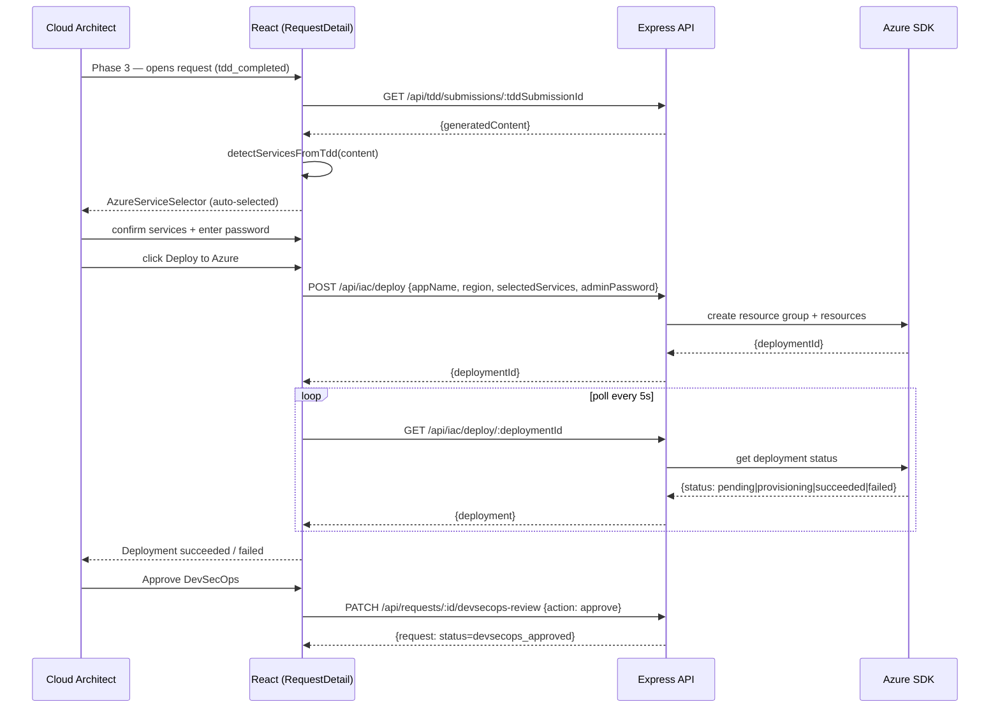

---

## 10. Docker Build

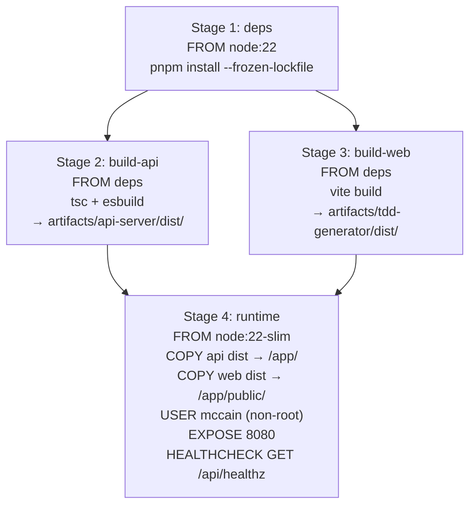

---

## 11. CI/CD Pipeline

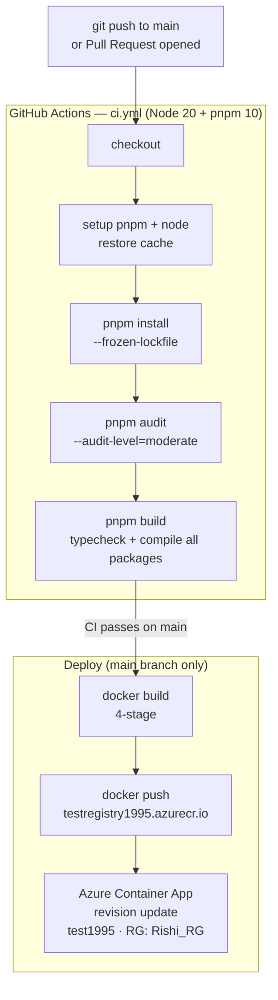
